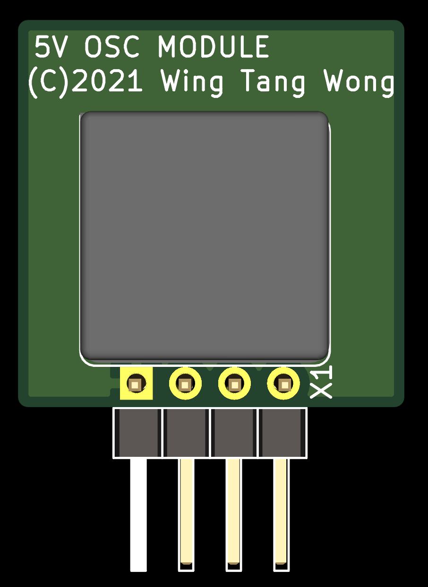

# WTC_CLOCK_MODULE

# Project Purpose

* Make use of existing components I had in stock. In this case, a bunch of 40Mhz PLE(Plextronics) DIP-8, 4pin oscillators.
* Do voltage conversion from whatever the OSC uses to whatever the mainboard expects/users.
* Keep the footprint small.
* Use this as a sort of re-usable module going forward.

# Parts

| Part Count | Part Name                 | Package                 | Part                                       | Usage                                                                                 | Notes                                                                                                                    |
| :----:     | :----                     | :----                   | :----                                      | :----                                                                                 | :----                                                                                                                    |
| 1          | SN74LVC1T45               | SOT-23-6                | Single Channel Bidirectional Level Shifter | Takes the OSC clk_out and brings the voltage down to lower voltage.                   | 22 Ohm resistor has the DIR fixed so A goes to B only.                                                                   |
| 2          | C23345 (LCSC Part Number) | 0603 SMD                | 22 Ohm Resistor                            | Bridges signal pins to VCC                                                            |                                                                                                                          |
| 1          | PLE-SQ3300-40.00Mhz OSC   | PDIP-8, 4pins, shortcan | 40Mhz 5V OSC                               | Plextronic's legacy/obsolete 40Mhz oscillator.                                        | Generates a 5V, 40Mhz clock signal. Enable tied to VCC via resistor. Output goes to SN74LVC1T45 to have voltage reduced. |
| 1          | ????                      | 2.54mm 1x4              | Right angle male header 4 pins             | Interface with parent module to provide a clock signal at the desired voltage levels. |                                                                                                                          |

The assumption regarding the pinout of the OSC:

| Pin     | Function                                           |
| :-----: | :---------------                                   |
| 1       | Enable/Disable (current limit resistor tied to 5V) |
| 4       | GND                                                |
| 5       | Clock Output                                       |
| 8       | VCC (5V)                                           |

